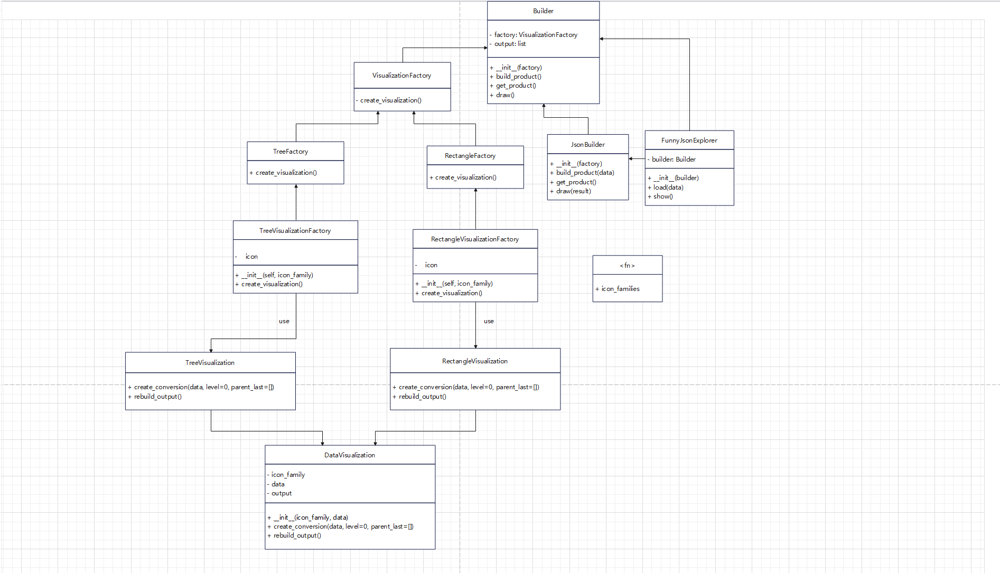

# 软件工程——Design Pattern

## 类图

不改变现有代码，如果想要添加新的风格，只需要添加新的风格抽象工厂：`NewFactory`和`VisualizationNew`，`NewVisualizationFactory`即可。

想要添加新的图表簇，修改icon_family_config.py即可。

 **工厂方法模式** ：

* `VisualizationFactory` 是一个抽象类，定义了创建 `DataVisualization` 对象的接口。
* `TreeFactory` 和 `RectangleFactory` 是 `VisualizationFactory` 的具体实现，负责创建 `TreeVisualization` 和 `RectangleVisualization` 的实例。
* `TreeVisualizationFactory` 和 `RectangleVisualizationFactory` 分别扩展了 `TreeFactory` 和 `RectangleFactory`，提供了额外的配置（如图标系列）。

 **建造者模式** ：

* `Builder` 类定义了一个逐步构建产品的接口。
* `JsonBuilder` 是一个具体的建造者类，专门为 JSON 数据构建 `DataVisualization` 产品。
* `FunnyJsonExplorer` 充当导演，使用建造者来编排构建过程。

 **组合模式** ：

* `TreeVisualization` 和 `RectangleVisualization` 中树形输出的结构类似于组合模式，其中每个节点可以是叶子节点（简单的键值对）或组合节点（字典）。

这些模式有助于以促进灵活性、可维护性和可扩展性的方式组织和结构化代码。
